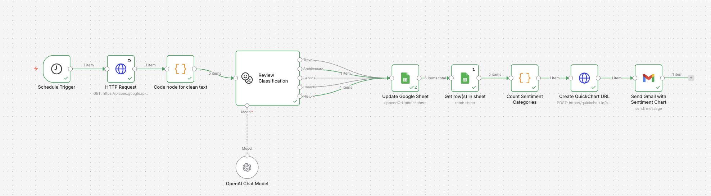

# 🧠 AI-Powered Review Classification & Insight Pipeline (n8n)

This project is an end-to-end automation pipeline that collects Google Maps reviews, classifies them using AI, and generates a visual report sent via email.

---

## 🚀 Overview

This workflow automates:

1. Fetching Google Maps reviews
2. Cleaning and preparing review text
3. Classifying reviews into **topic categories using OpenAI (LLM)**
4. Combining classification with **user rating data (1–5 stars)**
5. Storing structured data in Google Sheets
6. Aggregating category-level insights
7. Generating a chart using QuickChart API
8. Sending an automated report via Gmail

---

## 🤖 AI-Powered Review Classification

Reviews are processed using OpenAI and classified into topic categories:

- Travel
- Architecture
- Service
- Crowds
- History

In addition, each review includes a **rating (1–5 stars)** from Google Maps.

This enables combining:

- **Topic classification (what users talk about)**
- **Rating signal (how users evaluate their experience)**

👉 Together, this allows identifying **key drivers of satisfaction and dissatisfaction**.

---

## 📊 Insight Layer

By combining topic classification with rating data, the system can:

- Identify which topics are most frequently mentioned
- Detect potential pain points (e.g., low-rated categories)
- Highlight strengths (e.g., high-rated categories)

### Example insights:

- "Architecture" → frequently mentioned + high ratings → strength  
- "Crowds" → frequently mentioned + lower ratings → potential issue  

---

## 🧪 Analytical Approach

This project combines:

- LLM-based text classification (unstructured → structured data)
- User-provided rating signals (quantitative feedback)

This hybrid approach enables richer analysis compared to standalone sentiment or classification models.

---

## 🛠️ Tech Stack

- **n8n** – workflow automation
- **OpenAI API** – text classification (LLM)
- **Google Maps API (Places API)** – review data
- **Google Sheets API** – data storage
- **QuickChart API** – chart generation
- **Gmail API / SMTP** – email delivery

---

## 🔄 Workflow



---

## 📂 Workflow File

👉 [Download workflow](workflow.json)

Import this file directly into n8n to run the project.

---

## ⚙️ Setup Instructions

### 1. Clone repository

```bash
git clone https://github.com/YOUR_USERNAME/ai-review-classification-pipeline.git
